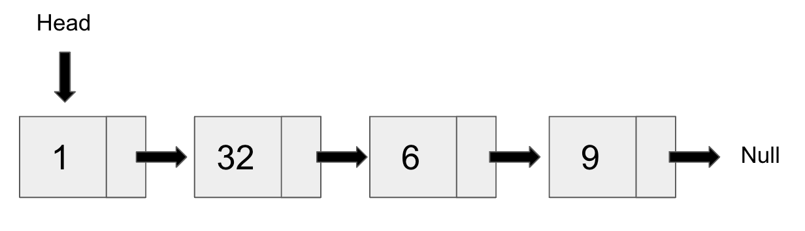

### Linked List?

연결리스트는 선형적인 데이터 구조라는 점에서 배열과 비슷하다. 하지만 배열과 다르게 연결 리스트의 요소들은 특정 메모리 주소나 인덱스에 저장되지 않고 각 요소가 포인터 또는 다음 객체에 대한 링크를 가지는 독립적인 객체에 가깝다.

연결 리스트의 각 요소를 노드(node)라고 부른다. 노드는 일반적으로 데이터와 다음 노드를 가리키는 링크로 구성되어 있다. 참고로 데이터 구성은 다양하게 올 수 있다.



- 연결 리스트의 가장 첫 번째 지점을 헤드(head)라고 부른다.
- 헤드는 연결 리스트의 첫 번째 노드를 의미한다.
- 마지막 노드는 null을 가르킨다.
- 만약 연결 리스트가 비어있는 경우 헤드는 null을 참조하게 된다.

```jsx
const list = {
    head: {
        value: 1
        next: {
            value: 32
            next: {
                value: 6
                next: {
                    value: 9
                    next: null
                    }
                }
            }
        }
    }
};
```

### Linked List의 장점

- 연결리스트는 데이터 구조의 큰 틀을 바꾸지 않고 노드를 추가하거나 삭제하기 쉽다.

### Linked List의 단점

- 연결리스트는 배열과 다르게 데이터에 무작위 접근(random access)할 수 없다. 데이터에 접근하기 위해서는 첫 번째 노드 부터 찾고자 하는 노드까지 순차적으로 접근하는 방법밖에 없다.
- 연결리스트는 배열보다 더 많은 메모리를 사용한다. 왜냐하면 각 노드는 데이터 뿐만 아니라 포인터도 담고 있기 때문이다.
