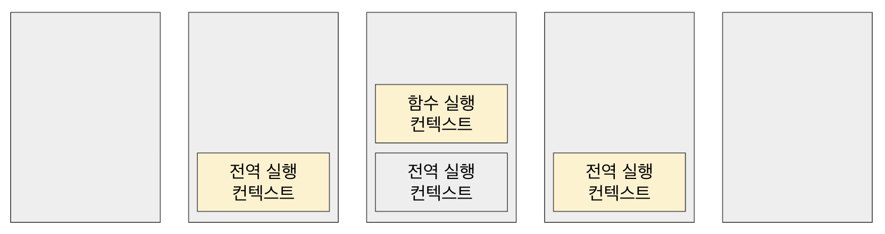

지금 까지 자바스크립트로 코딩하면서 실행 컨텍스트가 정확히 어떻게 작동하는지 모르고 사용하고 있었고 이번기회에 정확히 실행 컨텍스트가 뭐고 어떤식으로 작동하는지 이해할 수 있었고 더 나아가 그 상위 개념인 자바스크립트가 식별자와 식별자에 바인딩된 값을 관리하는 방식, 호이스팅이 일어나는 이유, 클로저의 작동 방식, 태스크 큐와 함께 동작하는 이벤트 핸들러와 비동기 처리의 동작 등을 이해하는데 많은 도움이 되었다.

### 소스코드의 타입

먼저 실행 컨텍스트를 알아보기전에 소스코드의 타입에 대하여 알아갈 필요가 있다.

소스코드의 타입은 4가지가 있으며 타입에 따라 실행 컨텍스트를 생성한다.

| 소스코드의 타입 | 설명                                                                                                        |
| --------------- | ----------------------------------------------------------------------------------------------------------- |
| 전역코드        | 전역에 존재하는 소스코드를 말한다. 단 전역에 정의된 함수와 클래스 등의 내부 코드는 포함하지 않는다.         |
| 함수 코드       | 함수 내부에 존재하는 소스코드를 말한다. 단 함수 내부에 중첩된 함수, 클래스 등의 내부코드는 포함하지 않는다. |
| eval 코드       | 빌트인 전역 함수인 eval 함수에 인수로 전달되어 실행되는 소스코드를 말한다.                                  |
| 모듈 코드       | 모듈 내부에 존자하는 소스코드를 말한다. 단 모듈 내부의 함수, 클래스 등의 내부 코드는 포함하지 않는다.       |

### 소스코드의 평가와 실행

모든 소스코드는 평가와 실행단계를 거친다.

소스코드의 평가 과정에서는 실행 컨텍스트를 생성한 뒤 변수, 함수 등의 선언문만 먼저 실행하여 생성된 변수나 함수 식별자를 키로 실행 컨텍스트가 관리하는 스코프(렉시컬 환경의 환경 레코드)에 등록한다.

평가 과정이 끝난 후 선언문을 제외한 소스코드를 순차적으로 실행시킨다. 즉 런타임이 시작된다. 이때 코드 실행에 필요한 정보를 실행 컨텍스트가 관리하는 스코프에서 검색해 취득한다. 그리고 변수 값의 변경 등 소스코드의 실행 결과는 다시 실행 컨텍스트가 관리하는 스코프에 등록된다.

1. 소스코드의 평가
2. 평가 결과를 실행 컨텍스트가 관리하는 스코프에 저장
3. 소스코드의 실행 (실행에 필요한 정보를 실행 컨텍스트가 관리하는 스코프에서 검색하여 취득)
4. 소스코드의 실행 결과를 실행 컨텍스트가 관리하는 스코프에 저장

### 실행 컨텍스트의 역할

1. 전역 코드 평가
   1. 전역에 작성된 변수 선언문과 함수 선언문을 실행한다.
   2. 그 결과로 생성된 전역 변수와 전역 함수를 실행 컨텍스트가 관리하는 전역 스코프에 등록한다. (여기서 var 키워드로 선언된 변수와 함수는 전역객체의 프로퍼티와 메서드로 등록된다.)
2. 전역 코드 실행
   1. 런타임이 시작되고 전역코드들은 순차적으로 실행된다.
   2. 여기서 함수가 호출되면 전역 코드 실행을 중지하고 코드 실행 순서를 변경하여 함수 내부로 진입힌다.
3. 함수 코드 평가
   1. 함수 블록에 작성된 선언문과 해당 함수의 매개변수를 실행한다.
   2. 그 결과로 생성된 매개변수와 지역 변수는 실행 컨텍스트가 관리하는 지역 스코프에 등록된다.
   3. 함수 내부에서 지역 변수 처럼 사용할 수 있는 arguments 객체가 생성되어 지역 스코프에 등록 되고 this 바인딩도 결정된다.
4. 함수 코드 실행
   1. 런타임이 시작되고 함수 코드들은 순차적으로 실행된다.
   2. 이때 함수 코드 실행에 필요한 정보를 스코프 체인을 통해 검색한다.
   3. 해당 함수의 생명 주기가 끝나면 다시 일시 중지 되었던 전역 코드 실행 단계로 돌아가 전역 코드 실행을 마무리 한다.

이와 같이 코드가 동작하기 위해서 현재 실행 중인 코드와 이전에 실행되었던 코드를 구분하여 관리해야 하며, 스코프에 식별자를 등록하고 관리해야한다. 이 모든 것을 실행 컨텍스트가 관리해준다.

### 실행 컨텍스트 스택

```javascript
let x = 100

function f1() {
  console.log(x)
}

function f2() {
  let x = 1000
  f1()
}

f2()
```

위 예제는 전역코드와 함수 코드로 이루어져 있고, 소스코드의 타입에 따라 실행 컨텍스트가 생성 된다.

생성된 실행 컨텍스트는 실행 컨텍스트 스택에서 관리한다.

코드의 실행 순서에 따라 실행 컨텍스트가 실행 컨텍스트 스택에 push 되고 pop 된다.



### 렉시컬 환경

렉시컬 환경은 식별자와 식별자에 바인딩된 값, 그리고 상위 스코프에 대한 참조를 기록하는 자료구조로 실행 컨텍스트를 구성하는 컴포넌트다.

렉시컬 환경은 키와 값으로 구성된 객체형태의 스코프(전역, 함수, 블록 스코프)를 생성하여 식별자를 키로 등록하고 식별자에 바인딩 된 값을 관리한다.

렉시컬 환경은 두가지로 구성된다.

#### 환경 레코드(Environment Record)

스코프에 포함된 식별자를 등록하고 등록한 식별자에 바인딩된 값을 관리하는 저장소다.

#### 외부 렉시컬 환경에 대한 참조(Outer Lexical Environment Reference)

외부 렉시컬 환경에 대한 참조는 상위 스코프를 가리킨다. 이때 상위 스코프란 외부 렉시컬 환경, 즉 해당 실행 컨텍스트가 생성한 소스코드를 포함하는 상위 코드의 렉시컬 환경을 말한다. 이를 통해 단방향 링크드 리스트인 스코프 체인을 구현할 수 있게된다.

## Source

- 이웅모, 모던 자바스크립트 Deep Dive, 위키북스, 2020
