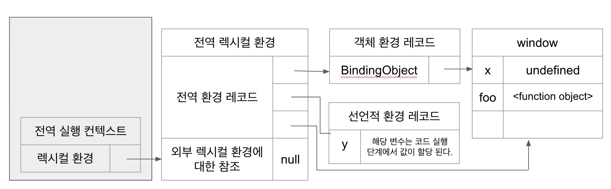

### 실행 컨텍스트의 생성과 식별자 검색 과정

#### 전역 객체 생성

전역 객체는 전역코드가 평가 되기전 생성된다. 전역 객체에는 빌트인 전역 프로퍼티,
빌트인 전역 함수, 표준 빌트인 객체가 추가되며 동작 환경에 따라(클라이언트 사이드, 서버 사이드)에 따라 클라이언트 사이드 Web API 또는 특정 환경을 위한 호스트 객체를 포함한다.

#### 전역 코드 평가

1. 전역 실행 컨텍스트 생성
   - 비어있는 전역 실행 컨텍스트를 생성하여 실행 컨텍스트 스택에 푸쉬한다.
2. 전역 렉시컬 환경 생성
   1. 전역 환경 레코드 생성
      - '전역 환경 레코드'는 '객체 환경 레코드' 와 '선언적 환경 레코드'로 구성되어 있다.
      - 객체 환경 레코드
        var, 함수 선언문으로 정의한 전역 함수, 빌트인 전역 프로퍼티와 빌트인 전역 함수, 표준 빌트인 객체를 관리
      - 선언적 환경 레코드
        let, const 키워드로 선언한 전역 변수를 관리
      1. 객체 환경 레코드 생성
         - 전역 환경 레코드를 구성하는 컴포넌트인 객체 환경 레코드는 BindingObject라고 부르는 객체와 연결된다.
         - BindingObject는 "전역 객체 생성" 에서 생성된 전역 객체다.
         - 전역 코드 평과 과정에서 'var 키워드'로 선언된 '전역 변수'와 '함수 선언문'으로 정의된 '전역 함수'는 '전역 환경 레코드'의 '객체 환경 레코드'에 연결된 'BindingObject'를 통해 '전역 객체'의 '프로퍼티'와 '메서드'가 된다.
         - var 키워드로 선언한 변수는 코드 실행단계에서 변수 선언문 이전에도 참조할 수 있다. 하지만 해당 값은 언제나 undefined다. var 키워드로 선언한 변수에 할당된 함수 표현식도 이와 동일하게 동작한다. 이것이 변수 호이스팅이 발생하는 원인이다.
         - 함수 선언문으로 정의한 함수가 평가되면 함수 이름 과 동일한 이름의 식별자를 객체 환경 레코드에 바인딩 된 BindingObject를 통해 전역 객체에 키로 등록하고 생성된 함수 객체를 즉시 할당한다. 이것이 변수 호이스팅과 함수 호이스팅의 차이다. 즉 함수 선언문으로 정의 한 함수는 함수 선언문 이전에 호출할 수 있다.
      2. 선언적 환경 레코드
         - let, const 키워드로 선언한 전역 변수, 함수 표현식은 선언적 환경 레코드에 등록하고 관리한다.
         - 그러므로 let, const 키워드로 선언한 전역 변수, 함수 표현식은 전역 객체의 프로퍼티로 등록되지 않는다.
         - 물론 let, const 키워드로 선언한 변수와 함수도 호이스팅이 발생한다. 하지만 해당 변수는 런타임에 컨트롤이 변수 선언문에 도달하기 전까지는 일시적 사각지대에 빠지기 때문에 참조할 수 없다.
   2. this 바인딩
      - 전역 환경 레코드의 `[[GlobalThisValue]]` 내부 슬롯에 this가 바인딩된다.
   3. 외부 렉시컬 환경에 대한 참조 결정
      - 현재 평가 중인 소스코드를 포함한 외부 소스코드의 렉시컬 환경, 즉 상위 스코프를 가리킨다. 이를 통해 단방향 링크드 리스트인 스코프체인을 구현한다.

#### 전역 코드 실행

전역 코드 평가가 끝난 후 전역 코드가 순차적으로 실행된다. 이때 변수 할당문이 실행 되면서 전역변수에 값이 할당 되 고 함수가 호출된다.

식별자는 스코프가 다르면 같은 이름을 가질 수 있다. 따라서 어느 스코프의 식별자를 참조해야하는지 결정할 필요가 있다. 이를 식별자 결정 이라 한다.

식별자 결정을 위해 실행 중인 실행 컨텍스트에서 식별자를 검색한다. 선언된 식별자는 실행 컨텍스트의 렉시컬환경의 환경 레코드에 등록되어 있다.

만약 실행중인 컨텍스트에서 식별자를 찾을 수 없으면 외부 렉시컬환경에 대한 참조를 통해 상위 스코프로 이동하여 식별자를 찾아낸다. 이것이 바로 스코프 체인의 원리이다.

#### 함수 코드 평가

전역 코드를 실행하는 중 함수 호출문을 마주치면 전역코드의 실행을 일시 중지하고 함수 내부로 코드의 제어권을 이동한다. 그리고 함수 코드의 평가를 시작한다.

1. 함수 실행 컨텍스트 생성
   1. 함수 실행 컨텍스트가 생성된다
   2. 함수 렉시컬 환경이 완성된 다음 생성된 함수 실행 컨텍스트가 실행 컨텍스트 스텍에 푸시된다.
2. 함수 렉시컬 환경 생성
   1. 함수 환경 레코드 생성
      1. 함수 환경 레코드는 매개변수, arguments 객체, 함수 내부에서 선언한 지역변수를 등록하고 관리한다.
   2. this 바인딩
      1. 함수 환경 레코드의 `[[ThisValue]]` 내부 슬롯에 this가 바인딩된다.
   3. 외부 렉시컬 환경에 대한 참조 결정
      1. 외부 렉시컬 환경에 대한 참조에 해당 함수 정의가 평가된 시점에 실행 중인 실행 컨텍스트의 렉시컬환경의 참조가 할당된다.

#### 함수 코드 실행

함수 코드의 평가가 끝나고 함수의 소스코드가 순차적으로 실행하는 런타임이 시작된다. 매개변수의 인수가 할당되고, 변수 할당문이 실행되면서 지역 변수에 값이 할당된다.

함수의 코드가 모두 실행 되면 해당 함수 코드의 실행이 종료된다. 그럼 실행 컨텍스트 스텍에서 해당 함수의 실행 컨텍스트가 팝되고 일시 중지 중이던 전역 코드의 실행 컨텍스트가 실행중인 실행컨텍스트가 되고, 전역 코드가 모두 실행되어 전역 코드의 실행이 종료되면 실행 컨텍스트 스텍에서 팝되어 제거되고 실행 컨텍스트 스텍에는 아무것도 남지 않게 된다.

### 후기

실행 컨텍스트를 공부하면서 복잡한 구조와 비슷한 명칭 덕분에 동작원리를 따라가는데 꽤나 힘들었었다.
하지만 실행 컨텍스트의 원리에 대하여 명확하게 이해하게 되면서 어설프게 알고 있었던 호이스팅이 왜 일어 나는지, 그리고 클로저와 이벤트 위임, 비동기 프로그래밍에 대하여 좀더 명확히 이해할 수 있게된 좋은 기회였던 것 같다.

## Source

- 이웅모, 모던 자바스크립트 Deep Dive, 위키북스, 2020
