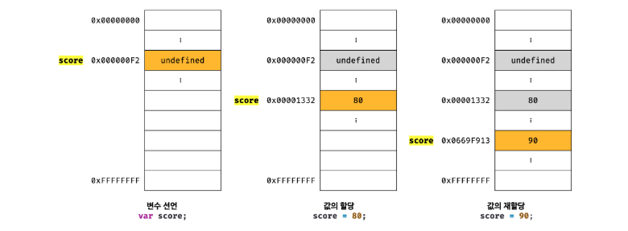
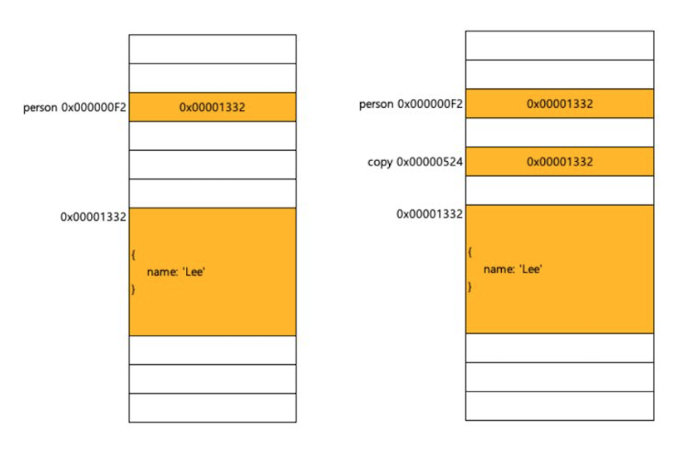

### 원시 타입과 참조 타입의 차이점 세가지

1. 원시값은 변경 불가능한 값(immutable value)이다. 이에 반해 객체(참조)타입은 변경이 가능한 값(mutable value)이다.
2. 원시값을 변수에 할당하면 실제 값이 저장된다. 이에 비해 객체를 변수에 할당하면 참조 값이 저장된다.
3. 원시값을 다른변수에 할당하면 원본의 원시값이 복사된다. 이를 **값에의한 전달**이라고 하며 객체를 가리키는 변수를 다른 변수에 할당하면 원본의 참조값이 복사되어 전달된다. 이를 **참조에 의한 전달**이라 한다.

### 원시값의 재할당

일단 원시값을 할당한 변수는 값을 저장하기 위한 메모리공간의 확보를 위해 붙인 이름이고 값은 표현식에 의해 평가되어 생성된 결과로써 **변경 불가능 하다는 것은 변수가 아니라 값에 대한 진술이다.**

### 원시값이 할당된 변수에 원시값을 재할당 하는 과정

1. 저장되어 있는값을 변경하는 것이 아닌 새로운 메모리 공간을 확보한다.
2. 재할당 원시값을 저장한다.
3. 변수는 새롭게 재할당한 원시 값을 가리킨다.
4. 이때 변수가 참조하던 메모리 공간의 주소가 바뀐다.

변수가 참조하던 메모리 공간의 주소가 변경된 이유 변수에 할당된 값이 변경 불가능한 값이기 때문이다.

원시값을 재할당하면 새로운 메모리공간을 확보하고 재할당한 값을 저장한 후 변수가 참조하던 메모리공간의 주소를 변경한다. 값의 이러한 특성을 불변성immutability이라 한다.

### 원시값 문자열의 독특한 특징

문자열은 몇 개의 문자로 이루워졌느냐에 따라 해당 메모리 공간의 크기가 결정된다.

문자열은 유사 배열 객체이며 이터러블 이므로 배열과 유사하게 각 요소에 접근할 수 있다.

하지만 문자열은 원시 값이므로 변경할 수 없다.

유사 배열객체

유사한 배열객란 배열처럼 인덱스로 프로퍼티값에 접근할 수 있고 length프로퍼티를 갖는 객체를 말한다.

### 값에 의한 전달

변수에 원시값을 갖는 변수를 할당하면 할당받는 변수에는 할당된 변수의 원시 값이 복사되어 전달된다. 이를 **값에 의한 전달**이라 한다.

이때 기존 변수와 값에 의한 전달을 받은 변수의 값은 똑같지만 **다른 메모리 공간에 저장된 별개의 값이다.** 그러므로 값에 의한 전달을 받은 변수의 값을 변경해도 **기존 변수의 값에는 어떠한 영향도 미칠 수 없다.**

결국 두 변수의 원시 값은 서로 다른 메모리 공간에 저장된 별개의 값이 되어 어느 한쪽에서도 재할당을 통해 값을 변경 하더라도 서로 간섭할 수 없다.

### 객체

객체는 프로퍼티의 개수가 정해져 있지 않으며, 동적으로 추가되고 지워질 수 있다.

### 객체(참조)타입의 변경 가능한 값 mutable value

객체는 할당한 변수가 기억하는 메모리 주소를 통해 메모리 공간에 접근하면 **참조 값reference value**에 접근할 수 있다. 여기서 참조값은 생성된 **객체가 저장된 메모리 공간 주소** 그 자체다.

### 객체의 할당

아래 사진과 같이 기존변수(person)과 기존변수에 할당한 변수(copy)가 같은 주소를 담고있고 같은 값을 참조한다.

객체는 변경 가능한 값이며 객체를 할당한 변수는 재할당 없이 객체를 직접 변경할 수 있다. **즉 재할당 없이 프로퍼티를 동적으로 추가할 수도 있으며 프로퍼티값을 갱신하고 프로퍼티값 자체를 삭제할 수도 있다.**

### 참조에 의한 전달

객체를 가리키는 변수를 다른 변수에 할당하면 원본의 참조 값이 복사되어 전달된다. 이를 **참조에 의한 전달**이라 한다. 이 말은 두 개의 식별자가 하나의 객체를 공유한다는 뜻이고 원본 또는 사본 중 어느 한쪽에서 객체를 변경 하면 **서로 영향을 주고 받는다.**
