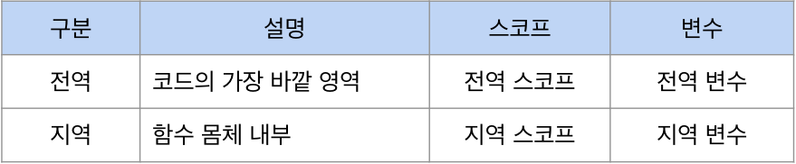
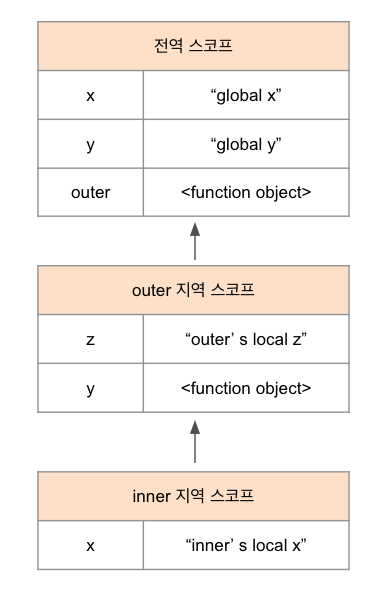

### 스코프

스코프란 모든 식별자(변수 이름, 함수 이름, 클래스 이름 등)는 자신이 선언된 위치에 의해 다른 코드가 식별자 자신을 참조할 수 있는 유효 범위가 결정하는 것이다.

### 식별자 결정

```jsx
var x = 'global'

function foo(){
	var x - 'local';
	console.log(x) //
}

foo();

console.log(x) //
```

위 코드의 가장 바깥영역과 foo함수 내부에 같은 이름의 변수 x 변수가 선언되었다. 이때 자바스크립트 엔진은 이름이 같은 두개의 변수 중에서 어떤 변수를 참조할지 결정해야 한다. 이를 **식별자 결정identifier resolution**이라 한다.

### 스코프의 종류

코드는 전역과 지역으로 구분돼있다



### 렉시컬 환경

"코드가 어디서 실행되며 주번에 어떤 코드가 있는지"를 렉시컬 환경이라고 한다. 코드의 문맥은 렉시컬 환경으로 이뤄지고 이를 구현한 것이 "실행 컨텍스트이며 모든 코드는 실행 컨텍스트에서 평가되고 있다.

### 스코프 체인

함수몸체 내부에서 함수가 정의된 것을 ‘함수의 중첩’이라 하고, 함수 몸체 내부에서 정의한 함수를 ‘중첩 함수’, 중첩함수를 포함하는 함수를 ‘외부함수’ 라고 한다.

함수는 중첩될 수 있으므로 함수의 지역 스코프도 중첩될 수 있다. 이는 스코프가 함수의 중첩에 의해 **계층적 구조를 갖는다는 것**을 의미한다.



스코프가 계층적으로 중첩된 것을 **스코프 체인**이라 한다.

### 스코프체인에 의한 변수 검색

스코프체인에 의한 변수 검색이란? 변수를 참조할 때 자바스크립트 엔진은 스코프 체인을 통해 변수를 참조하는 코드의 스코프에서 시작하여 상위 스코프 방향으로 이동하며 검색하는 것이다.

### 렉티컬 환경

스코프 체인은 실행 컨텍스트의 렉시컬 환경을 단방향으로 연결 한 것이다. 전역 렉시컬 환경은 코드가 로드되면 곧바로 생성되고 함수의 렉시컬 한경은 함수가 호출되면 곧바로 생성된다.

### 함수 레벨 스코프

함수 레벨 스코프란? var키워드로 선언된 변수는 오로지 함수의 코드 블록(함수 몸체)만을 지역 스코프로 인정하는 특성이다.

여기서 let, const 는 블록 레벨 스코프를 지원한다.

### 렉시컬 스코프

```jsx
var x = 1

function foo() {
  var x = 10
  bar()
}

function bar() {
  console.log(x)
}

foo() // 1
bar() // 1
```

상위 스코프가 동적으로 변하지 않고 함수 정의가 평가되는 시점에 상위 스코프가 정적으로 결정 되기 때문에 정적 스코프라고 부르기도 한다.

자바스크립트는 렉시컬 스코프를 따르므로 함수를 어디서 호출했는지가 아니라 함수를 어디서 정의했는지에 따라 상위 스코프를 결정한다. 함수가 호출된 위치는 상위스코프 결정에 어떠한 영향도 미치지 않는다. 즉 함수의 상위 스코프는 언제나 자신이 정의된 스코프다.
