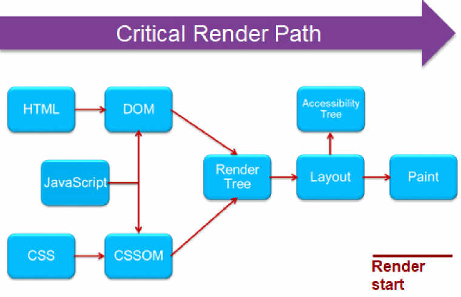
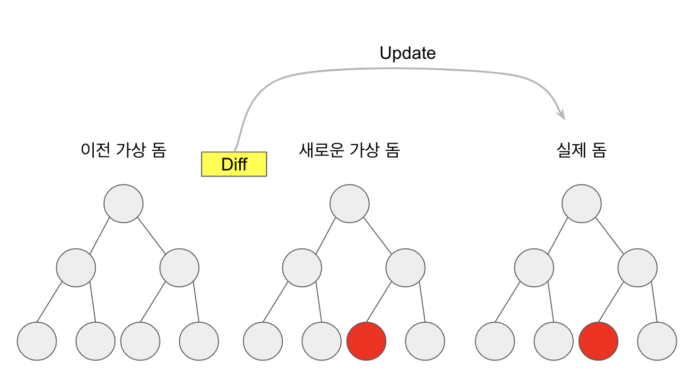

### React 가 웹을 렌더링 하는 과정

1. 클라이언트가 해당 웹에 접속한다.
2. 서버는 클라이언트에게 index.html과 App.js를 보낸다.
3. 서버로 부터 받은 파일로 Render Tree를 구성하고 이를 바탕으로 실제 화면에 렌더링한다.

여기서 index.html과 App.js만 받아와서 사용자에게 웹 앱을 보여준다. 해당 동작이 가능한 이유는 번들러(webpack)가 웹 앱에 필요한 모든 파일들을 하나로 결합하여 파일 하나로 모든 동작을 작동할 수 있게 해준다. 이로 인하여 서버의 부하를 줄이고 로딩시간도 줄일 수 있게 된다.

하지만 첫 로딩에 모든 기능이 하나로 묶인 페이지를 가저오다 보니 사용자가 첫 화면을 보기까지 오랜 시간이 걸리고, index.html 하나뿐이기 때문에 SEO에 분리하다.

### 브라우저가 렌더링 하는 과정 CRP Critical Rendering Path

https://dimension85.com/glossary/critical-render-path

브라우저가 서버에서 페이지에 대한 HTML 응답을 받고 화면에 표시하기 전 단계

1. 렌더 엔진이 문서를 읽어들여서 그것들을 파싱하고 어떤 내용을 페이지에 렌더링할지 결정한다. DOM tree 생성하게 된다.
2. 다음 단계로 Render Tree 를 생성하는데 이 과정에서 DOM과 CSS 파일을 결합하여 화면에 표시되는 모든 콘텐츠 및 스타일 정보를 포함하게 된다.
3. Layout 단계에서는 브라우저의 페이지에 표시되는 각 요소의 크기와 위치를 계산하는 단계이다.
4. Paint 단계에서 실제 화면에 그려준다.
5. DOM에 변화가 생길 때 마다 Render Tree가 재생성된다.

위 과정의 문제점은 DOM에서 작은 변화라도 생기면 그때마다 Render Tree를 재생성하게 된다. 이 문제는 인터렉션이 적은 웹에서는 문제가 없지만 요즘처럼 인터렉션이 많은 웹에서는 성능상에 많은 문제를 받을 수 있다.

위 문제를 해결하기 위해서 나온 것이 가상 돔 Virtural Dom이다.

가상 돔은 간단하게 말해서 실제 DOM을 메모리에 복사한 것이라 생각하면 된다.

### 가상 돔의 작동 방식

1. 데이터가 바뀌면 가상돔에 렌더링 된다.
2. 이전에 생성 됐던 가상돔과 비교하여 바뀐 부분을 찾는다. (이 과정을 Diffing이라고 부른다.)
3. Diffing으로 찾은 바뀐 분분을 실제 돔에 적용시킨다. (이 과정을 reconciliation이라고 부른다.)

이러한 가상 돔 덕분에 많은 요소들이 변하더라도 한번에 묶어서 실제 돔에 수정하기 때문에 돔조작의 비용을 줄일 수 있다.
