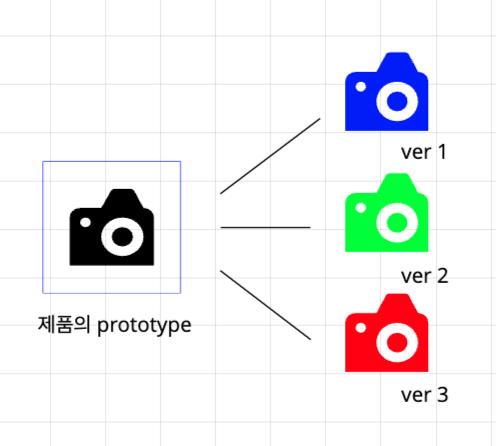

### 객체지향 프로그래밍?

컴퓨터 프로그래밍의 페러다임 중 하나 이며, 컴퓨터 프로그램을 명령어 목록으로 보는 시각에서 벗어나 여러개의 독립된 단위, 즉 객체들의 모임으로 파악하고자 하는 것이다.

객체지향 프로그래밍은 제품 설계를 할 때에 청사진과 그것을 기반으로 원형은 같지만 여러가지 옵션을 추가하거나 뺀 제품들을 찍어내는 원리와 비슷하다고 생각한다.

### 객체지향 프로그래밍을 해야하는 이유

객체지향 프로그래밍으로 작성한 코드는 기능이나 요소가 각각의 객체로 나뉘어져 있기에 코드를 보는이 입장에서 좀더 직관적으로 볼 수 있으며 프로그램을 유연하고 쉽게 변경할 수 있고 유지보수할 때 예기치 못한 애러를 줄일 수 있다

### 객체지향 프로그래밍의 기본적인 4가지 개념이 있다.

1. 캡슐화

   캡슐화라는 개념에는 은닉화라는 특징이 포함돼있는데 내부 데이터나 내부 구현은 외부로 노출되지 않게 숨기고 외부에서 필요로 하는 구현만 노출 시키는 방법이다. 해당 코드가 외부의 코드의 작동과 연관되지 않게 분리시켜서 유지보수에서 큰 이점을 가져올 수 있다.

2. 추상화

   추상화는 실제 내부 구현은 복잡하지만 해당 프로그램을 접하는 자가 보는 부분은 단순하게 설계한다는 개념이다. 예를들어 컴퓨터의 내부는 cpu, ram, 그래픽카드, 쿨링 시스템 등으로 복잡하게 구성돼 있지만 사용자가 실제로 접하는 외부는 전원버튼, 출력 디스플레이, 각종 입력장치 등으로 단순하게 구성되어 있다. 이처럼 프로그램도 코드를 접하는사람이 간단하게 볼 수 있도록 설계할 수 있도록 해준다. 클래스 정의 시, 메서드와 속성만 정의한 것을 인터페이스라고 부르며 이것이 추상화의 본질이다.

3. 상속

   말그대로 부모 클래스의 특징을 자식 클래스가 물려받는 것이다.

   예를 들어 아이폰 13이라는 클래스가 있다고 가정한다. 아이폰 13에는 기본적으로 제조사, 운영체제 등 기본적인 메서드가 있다고 생각할 수 있다. 그리고 아이폰 14에는 기본적인 정보에서 업그레이드 된 성능이나 새로운 기능들이 추가로 구성된다. 이때 아이폰 14라는 클래스를 다시 구현하는 방법 보다는 아이폰14의 본질인 아이폰13의 클래스를 가져와 추가된 기능들만 넣어주는 방식이 더 효율적일 것이다. 이것이 상속 개념의 원리이다.

4. 다향성

   같은 메서드로 다른 기능을 구현할 수 있어야 한다.

   예를 들어 엘리먼트에는 여러가지 기능을 가진 요소들이 있다. 이 엘리먼트들을 직접 구현한다고 생각하면 모든 엘리먼트는 객체이므로 내부적으로는 모양을 그리고 화면에 뿌리는 렌더하는 메서드가 존재할 것이다. 이 경우에는 엘리먼트들의 공동 부모인 HTML Element라는 클래스에 render라는 메서드를 만들고 상속되는 엘리먼트들은 렌더라는 메서드를 가질 수 있다. 여기서 핵심은 element들은 쓰임에 따라 다양하게 사용되기에 render와 같인 공통적으로 사용되는 기능 외에 각각의 기능을 가질 수 있게 만들어서 조금식 다르게 작동된다. 이것이 바로 다향성이다.
