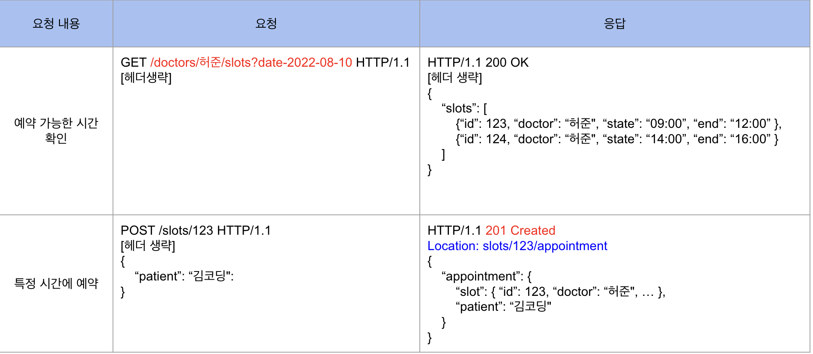

### REST(Representational State Trensfer) API

웹에서 사용되는 데이터나 자원(Resource)을 HTTP URI로 표현하고, HTTP 프로토콜을 통해 요청과 응답을 정의하는 방식

### REST 성숙도 모델 - 0단계

REST 성숙도 모델 \_0단계: HTTP 프로토콜을 사용한다.

### REST 성숙도 모델 - 1단계

REST 성숙도 모델 \_1단계: 개별 리소스(Resource)와의 통신을 준수한다.

웹에서 사용되는 모든 데이터나 Resource를 HTTP URI로 표현한다. 따라서 모든 Resource는 개별 Resource에 맞는 엔드포인트(Endpoint)를 사용해야하며 요청하고 받는 자원에 대한 정보를 응답으로 전달해야 한다는 것이 1단계의 핵심이다.

앞서 0단계에서는 요청에서의 엔드포인트를 모두 / appointment 를 사용하였다. 하지만 1단계에서는 요청하는 리소스가 무엇인지에 따라 각기 다른 엔드포인로 구분하여 사용한다.

위 예시에서 ‘예약 가능한 시간 확인’이라는 요청의 응답으로 받는 Resource는 허준이라는 의사의 예약 가능한 시간대다. 그렇기 때문에 요청시 `/doctor/허준` 이라는 엔드포인트를 사용했다.

특정시간에 예약하게 되면 실제 slots라는 리소스의 123이라는 id를 가진 리소스가 변경되기 때문에, 하단의 특정 시간에 예약이라는 요청에서는 `/slots/123` 으로 실제 변경되는 리소스를 엔드포인트로 사용했다.

엔드포인트 작싱시에는 동사, HTTP 메서드, 혹은 어떤 행위에 대한 단어 사용은 지양하고, 리소스에 집중해서 명사 형태의 단어로 적성하는 것이 바람직하다.

요청에 따른 응답으로 리소스를 전달할 때에도 사용한 리소스에 대한 정보와 함께 리소스 사용에 대한 성공/ 실패 여부를 반환해야한다. 예를들어 허준 의사가 9시에 예약을 했으나 해당시간이 마감되어 예약이 불가능할 경우, 아래와 같이 리소스 사용에 대한 실패 여부를 포함한 응답을 받아야 한다.

### REST 성숙도 모델 -2단계

모델 2단계에서는 CURD에 맞게 적절한 HTTP 메서드를 사용하는것에 중점을 둔다.

예약 가능한 시간을 확인한다는 것은 예약 가능한 시간을 조회(READ)하는 의미 이고, 특정시간에 예약하는 것은 특정시간 예약을 생성(CREATE)하는 의미한다. 그러므로 조회(READ)하기 위해서는 `GET` 메서드를 사용하고, 이때 `GET` 메서드는 `body` 를 가지지 않기 때문에 query parameter를 사용하여 필요한 리소스를 전달한다.

예약을 생성(CREATE)하기 위해서는 `POST` 메서드를 사용하여 요청을 보내야하며 `POST` 요청에 대한 응답이 어떻게 반환되는지가 중요하다. 이 경우 새롭게 생성된 리소스를 보내주기 때문에, 응답코드는 `201 Create` 로 명확하게 작성해야 하며, 관련 리소스를 클라이언트가 `Location` 헤더에 작성된 URI를 통해 확인할 수 있도록 해야한다.

`POST` 메서드는 요청마다 새로운 리소스를 생성하고 `PUT` 메서드는 요청마다 같은 리소스를 반환한다. 이렇게 매 요청마다 같은 리소스를 반환하는 것을 역등(idempotent)하다고 한다.

`PUT` 메서드는 교체, `PATHCH` 는 수정의 용도로 사용한다.
