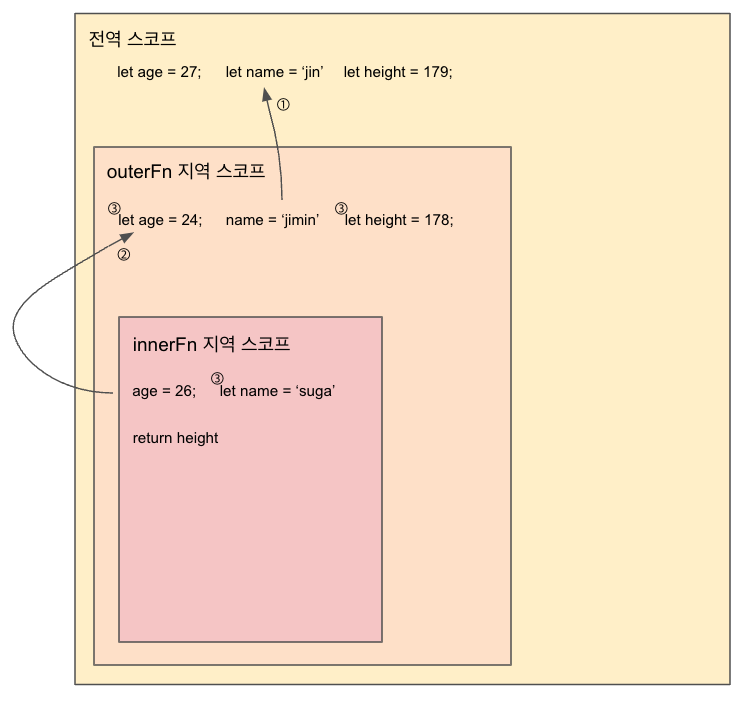

### javascirpt koans를 시작하며

JavaScirpt Koans는 내가 지금 참여하고 있는 부트캠프에서 지원하는 mochajs기반의 테스트형 학습 툴이다. 초반 문제들은 난이도가 낮아 쉽게풀어갈 수 있지만 중 후반부터는 문제가 참고하는 개념들이 점점 어려워 지면서 생각보다 많은 시간을 고민해야 문제를 풀 수 있었다. 그중에서 몇가지 어려웠던 문제와 문제를 풀면서 처음 접하게 된 javascirpt 내장 메서드를 소개해보려 한다.

### javascirpt koans진행하면서 어려웠던 문제

04_Scope의 “lexical scope와 closure에 대해 확인합시다”문제가 어려웠다.

해당문제는 스코프, 렉시컬환경과 렉시컬 스코프 그리고 클로저에 대한 개념을 알고 있어야 풀 수 있는 문제였다.

```jsx
it('lexical scope와 closure에 대해 다시 확인합니다.', function () {
  let age = 27
  let name = 'jin'
  let height = 179

  function outerFn() {
    let age = 24
    name = 'jimin'
    let height = 178

    function innerFn() {
      age = 26
      let name = 'suga'
      return height
    }

    innerFn()
    expect(age).to.equal(26) // equal()괄호안에 정답을 작성
    expect(name).to.equal('jimin')

    return innerFn
  }

  const innerFn = outerFn()

  expect(age).to.equal(27)
  expect(name).to.equal('jimin')
  expect(innerFn()).to.equal(178)
})
```



① outerFn이 변수를 참조할 때 자신이 선언된 스코프의 변수만 참조한다.

② innerFn 지역 스코프에서 age라는 이름을 가진 변수에 26을 할당 하라는 코드가 있다 그럼 자바스크립트는innerFn 함수가 정의된 상위 스코프에서 age라는 이름의 변수를 찾아 해당 값을 할당한다.

③ 함수 내에서 선언된 변수는 함수의 호출 후 생명주기가 끝나면 사용할 수 없다.
