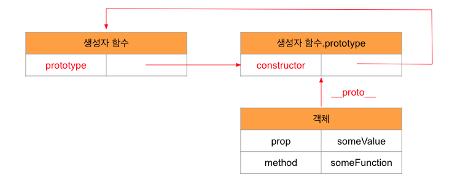

### 프로토타입

javascript는 prototype기반 언어다. 여기서 프로토타입은 원형 객체를 의미함

javascript는 객체를 상속하기 위해 프로토타입이라는 방식을 사용한다. 모든 객체들이 메소드와 속성을 **상속 받기** 위한 템플릿으로써 프로토타입 객체를 가진다는 의미이다. 프로토타입 객체도 또 다시 상위 프로토타입 객체로부터 메소드와 속성을 상속 받을 수도 있고 그 상위 프로토타입 객체도 마찬가지다. 이를 **프로토타입 체인**이라고 부른다. 다른 객체에 정의된 메소드와 속성을 한 객체에서 사용할 수 있도록 하는 근간이다. 정확히 말하면 상속되는 속성과 메소드들은 각 객체가 아니라 **객체의 prototype이라는 속성에 정의**되어 있다.

### **proto** 접근자 프로퍼티

모든 객체는 **proto** 접근자 프로퍼티를 통해 자신의 프로토타입, 즉 자신의 [[Prototype]]내부 슬롯에 간접 적으로 접근할 수 있다.
