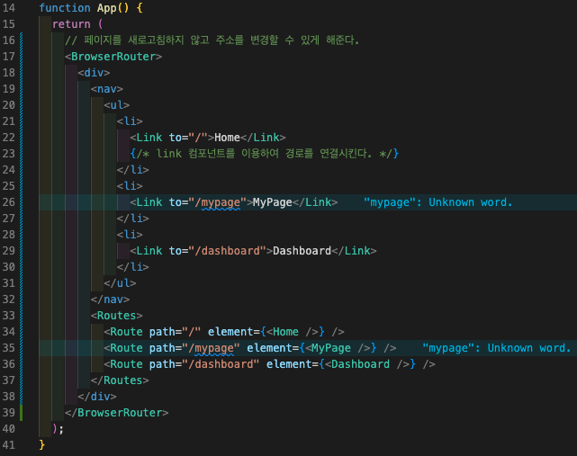

### React SPA

기존의 웹페이지는 유저에게 보여줄 페이지 하나하나를 서버에서 전달받아 렌더링했지만 웹페이지의 규모가 커지면서 사용자와의 상호작용이 많아지면서 그에 따른 속도 저하등의 문제가 발생하였다. 이러한 문제를 하결하기위에 필요한 부분만 렌더링하는 SPA를 사용하여 그때그때 필요한 데이터들만 서버와 주고받을 수 있고 페이지 전체를 렌더링하는 것이 아닌 필요한 부분만 업데이트해 보다 나은 사용자 경험을 제공한다.

### React SPA의 단점

브라우저는 첫 화면 로딩시에 HTML파일을 읽어들인 후 그 안의 script의 js파일을 다시 받아오는 과정을 거친다. 이때 첫 로딩 시 읽어들인 HTML파일은 거의 비어있고, 대부분의 코드는 JS파일 안에 들어있어 JS파일이 무거워진다. 이 때문에 JS파일을 기다리는 첫 로딩은 길어질 수 밖에 없다.

검색 엔진 최적화가 좋지 않다. 검색 로봇은 자료를 수집할 때에 페이지의 URL과 HTML문서 안의 각종 태그나 링크등을 분석한다. 하지만 SPA의 HTML은 거의 비어있다 보니 충분한 자료수집을 할 수 없다. 이 때문에 검색엔진 최적화에 대한 대응책을 따로 마련해야한다. 더불어 앱 안에서의 브라우저의 앞으로 가기 뒤로가기 등의 상태 관리도 해야 하기 때문에 개발의 복잡도가 올라간다.

### React Router

SPA는 하나의 페이지처럼 보이지만 페이지의 상태에 따라 여러가지 화면이 존재한다. 이에 따라 화면의 주소도 달라진다. 이렇게 주소에 따라 다른 뷰를 보여주는 것을 Routing이라고 한다.

### React Router의 주요 컴포넌트

`<BrowserRouter>` Router기능

페이지를 새로고침하지 않고 주소를 변경할 수 있게 해준다. BrowserRouter는 상위에 작성된다.

`<Router>` 경로를 매칭

`<Route>` 경로를 매칭

`<Link>` 경로를 변경

