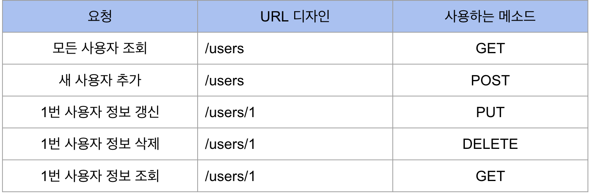
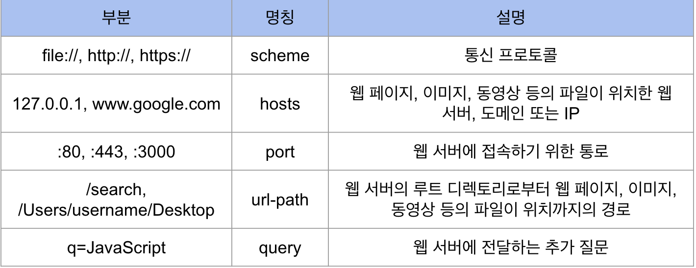

## 서버 통신과 API

클라이언트와 서버가 통신하려면 프로토콜이 있어야 한다.

웹 어플리케이션 아키텍처에서는 주로 클라이언트와 서버가 HTTP라는 프로토콜로 통신한다. HTTP를 이용해서 주고받는 메시지는 “HTTP 메시지”라고 부른다.

### API (Application Programming Interface)

interface의 사전적 의미는 “의사소통이 가능”하도록 만들어진 “접점”을 의미한다. 이 의미에 따르면, 메뉴판도 인터페이스라고 볼 수 있다.

API는 앱이 요청가능하고 프로그래밍할 수 있는 인터페이스다.

API를 구축해놓아야 클라이언트가 이를 활용할 수 있다.

보통 인터넷에 있는 데이터를 요청할 때에는 HTTP라는 프로토콜을 사용하며, 주소(URL, URI)를 통해 접근할 수 있다.

HTTP API 디자인에는 Best Practice가 존재한다.

HTTP요청에는 메서드라는 것이 존재한다.

GET조회, POST추가, PUT(또는 PATCH)갱신, DELETE삭제

### URL (Uniform Resource Location)

네트워크 상에서 웹 페이지, 이미지, 동영상 등의 파일이 위치한 정보를 나타낸다.

### URI (Uniform Resource Identifier)

ULR의 기본요소인 scheme, hosts, url-path에 더해 query, fragment를 포함한다.

query는 웹 서버에 보내는 추가적인 질문이다.

fragment는 일종의 북마크 기능을 수행하며 URL에 fragment(#)와 특정HTML 요소의 id를 전달하면 해당 요소가 있는 곳으로 스크롤을 이동할 수 있다.

브라우저 검색창을 클릭하면 나타는 주소가 URI이다. URI는 URL을 포함하는 상위개념이다.

### IP (Internet Protocol)

인터넷상에서 사용하는 주소체계를 말한다. 인터넷에 연결된 모든 PC는 IP 주소체계를 따라 네덩이의 숫자로 구분된다. 이렇게 네덩이의 숫자로 구분된 IP주소 체계를 IPv4라고 한다. IPv4는 internet protocol version 4의 준말로 IP주소체계의 네번째 버전을 의미한다.

localhost, 127.0.0.1: 현재 사용 중인 로컬 PC를 뜻함

0.0.0.0, 255.255.255.255: broadcast address, 로컬 네트워크에 접속된 모든 장치와 소통하는 주소? 서버에서 접근 가능 IP 주소를 broadcast address로 지정하면, 모든 기기에서 서버에 접근할 수 있다.

### PORT

IP주소가 가리키는 PC에 접속할 수 있는 통로(채널)을 의미한다.

포트 번호는 0 ~ 65535까지 사용할 수 있고 그중에서도 0 ~ 1024번 까지의 포트 번호는 주요 통신을 위한 규약에 따라 이미 정해져 있다.

- 22: SSH
- 80: HTTP
- 443: HTTPS

이미 정해진 포트라도 필요에 따라 자유롭게 사용할 수 있다. HTTP(:80), HTTPS(:443)처럼 잘 알려진 포트번호는 생략해서 쓸 수 있다.
